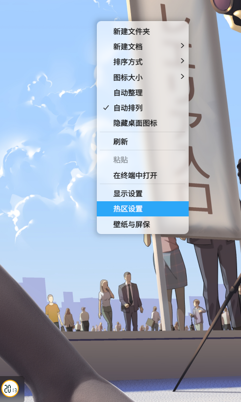

# GXDE 热区

支持 x11 和 wayland 的桌面环境

config file: $HOME/.config/GXDE/gxde-requ/gxde-requ-setting.qaq

格式：
```
TopLeftShell=
TopRightShell=
LowerLeftShell=
LowerRightShell
```

在GXDE下，可通过热区设置进行快捷设置




在其他桌面，可通过执行 gxde-requ-setter 设置

```
gxde-requ-setter 
用法：
/usr/bin/gxde-requ-setter --set <热角> <命令>    修改指定热角的命令
/usr/bin/gxde-requ-setter --clear <热角>        清除指定热角的命令
/usr/bin/gxde-requ-setter --gui                调出图形化配置器

```

